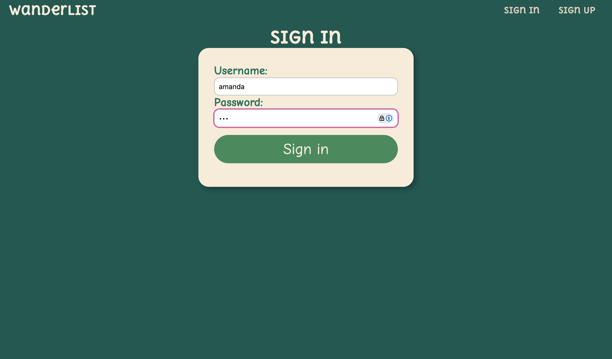

# WanderList

WanderList is a full-stack travel destination tracking application that allows users to store details about places they have visited or plan to visit. The application provides user authentication, photo uploads, and interactive UI elements to enhance the travel tracking experience.

## Landing Page

![landing page][def]

## Signin Page



## Add New Page


## See All User Destinations


## Search and Upload Photos


## Show details about a single destination


## Edit Page


## Live Demo

The application is fully deployed and can be accessed here:
[WanderList on Heroku](https://wanderlist-e7bb02f51821.herokuapp.com/)

## Features

- **User Authentication**: Secure sign-in and sign-out functionality using session-based authentication.
- **Destination Management**: Users can create, read, update, and delete destinations.
- **Photo Uploads**: Supports image uploads using Cloudinary for cloud storage and Unsplash API for external image search.
- **Session Management**: Tracks user sessions and provides a personalized experience.
- **Interactive UI**: Includes dynamic elements such as slideshows and smooth UI interactions.

## Technologies Used

### **Back-end**

- **Node.js** – Runtime environment for JavaScript.
- **Express.js** – Web framework for routing and middleware management.
- **MongoDB & Mongoose** – NoSQL database for storing users and destinations.
- **Cloudinary** – Image hosting and management service.
- **Unsplash API** – Fetches images for destinations.
- **Session-based Authentication** – Uses `express-session` and `connect-mongo`.

### **Front-end**

- **EJS (Embedded JavaScript)** – Template engine for rendering dynamic content.
- **CSS (Custom Stylesheets)** – Handles UI styling (`style.css`, `show.css`, `partials.css`).
- **JavaScript (Client-side)** – Enhances user interactions (`slideshow.js`).

## Project Structure

```
|-- public/                # Static assets (CSS, JS, Images)
|-- views/                 # EJS templates
|   |-- index.ejs          # Home page
|   |-- destinations/      # Destination pages
|   |   |-- index.ejs      # Displays all destinations
|   |   |-- new.ejs        # Form for creating new destinations
|   |   |-- edit.ejs       # Form for editing destinations
|   |   |-- show.ejs       # Displays details for a single destination
|   |-- photos/            # Photo-related pages
|   |   |-- search.ejs     # Displays image search results from Unsplash
|   |-- auth/              # Authentication templates
|   |-- partials/          # Navbar and reusable components
|
|-- routes/                # Route handlers
|   |-- authRoutes.js      # Authentication routes
|   |-- destinationRoutes.js # Destination CRUD operations
|   |-- photoRoutes.js     # Photo upload routes
|
|-- controllers/           # Controller logic
|   |-- authController.js  # Handles user authentication
|   |-- destinationController.js # Manages destinations
|   |-- photoController.js # Manages photo uploads & search
|
|-- middleware/            # Middleware functions
|   |-- is-signed-in.js    # Ensures user authentication
|   |-- pass-user-to-view.js # Passes session data to views
|   |-- upload-error-handler.js # Handles image upload errors
|
|-- models/                # Mongoose models
|   |-- user.js            # User schema
|   |-- destination.js     # Destination schema
|
|-- config/                # Configuration files (Cloudinary setup)
|-- server.js              # Main application entry point
```

## Usage

1. **Sign Up/Login**: Create an account or log in.
2. **Add Destinations**: Click "Add New Destination" to create an entry.
3. **Edit/Delete**: Modify or remove a destination entry.
4. **Upload Photos**: Add images to destinations using Cloudinary or select from Unsplash.

## Resources Used

- **Background Image**: [Unsplash](https://unsplash.com/photos/birds-eye-photography-of-shoreline-3RicCdnXfHs)
- **Favicon**: [Freepik](https://www.freepik.com/icon/map_1595818)
- **Photo Carousel**: [CSS-Tricks](https://css-tricks.com/css-only-carousel/)
- **Readme Generation**: [Chat-GPT](https://chatgpt.com/)

## Future Enhancements

- Implement user groups for shared travel lists.
- Enable users to comment on shared destinations.
- Enhance UI with additional animations and interactive elements.
- Optimize database indexing for better performance.

## Contributing

Feel free to fork the repository and submit pull requests with improvements.

## Author

- **Amanda Bloomfield**
- [GitHub](https://github.com/abl00mfield/wanderlist)

[def]: /public/images/image.png
